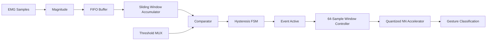

# event-driven-emg-soc

An event-driven SystemVerilog architecture for real-time EMG gesture recognition, combining low-cost signal activity detection with a quantized neural-network accelerator.

The system is designed to avoid unnecessary inference while meaningful muscle activity is absent. Once EMG activity is detected, the system collects fixed-size active-signal windows and forwards them to a hardware neural-network accelerator for gesture classification.

## System Architecture



The design consists of two primary subsystems:

1. An event detector that continuously monitors EMG activity.
2. A neural-network accelerator that performs gesture classification only when an event is active.

---

## Event Detector

The event detector estimates EMG activity using the magnitude of incoming signed samples.

For each sample:

\[
m[n] = |x[n]|
\]

Instead of recomputing an entire window sum for every new sample, the detector uses a sliding-window accumulator:

\[
S[n] = S[n-1] + |x[n]| - |x[n-N]|
\]

where:

- \(N\) is the detector window size
- \(x[n]\) is the newest sample
- \(x[n-N]\) is the oldest sample leaving the window

A FIFO stores previous magnitudes so the oldest value can be removed as each new value enters the window.

This reduces the sliding-window update to one addition and one subtraction per valid sample.

### Hysteresis Detection

The activity level is evaluated using separate high and low thresholds.

The detector uses three states:

- **Idle**
- **Active**
- **Cooldown**

A threshold multiplexer selects the appropriate threshold depending on the current detector state.

This hysteresis prevents rapid switching when the signal fluctuates near a single threshold.

The event detector therefore follows the approximate datapath:

```text
EMG Sample
    |
    v
Magnitude
    |
    v
FIFO -----> Oldest Magnitude
    |              |
    +-------> Sliding Sum
                 |
                 v
          Threshold Comparator
                 ^
                 |
          Threshold MUX
                 |
                 v
           Hysteresis FSM
                 |
                 v
             event_out
```

---

## Neural-Network Accelerator

When the event detector enters the Active state, active EMG samples are collected for neural-network inference.

The accelerator operates on fixed-size windows of:

\[
64 samples
\]

The 64-sample window is not a limit on the duration of an EMG event.

If the event remains active after one inference window, the system collects another 64 samples and performs another inference.

```text
Event becomes active
        |
        v
Collect 64 samples
        |
        v
Run inference
        |
        v
Is event still active?
     /       \
   Yes        No
    |          |
    v          v
Collect      Finish
next 64
samples
```

The event detector FSM and the accelerator window controller operate independently.

---

## Accelerator Architecture

The neural-network accelerator is being developed around quantized integer arithmetic.

The core computational primitive is the multiply-accumulate operation:

\[
y = \sum_i w_i x_i + b
\]

The hardware therefore uses MAC units to perform neural-network layer computations.

The initial classifier will use a compact feed-forward neural network suitable for FPGA implementation.

A typical layer will have the form:

\[
\text{Linear} \rightarrow \text{Activation} \rightarrow \text{Linear}
\]

ReLU is currently the primary activation candidate because of its very low hardware cost:

\[
\operatorname{ReLU}(x)=\max(0,x)
\]

Model training and quantization will be performed in software before weights and parameters are transferred to the RTL accelerator.

---

## Quantization

The accelerator is intended to use low-precision integer arithmetic, with INT8 currently targeted for neural-network weights and activations.

The planned training flow is:

```text
EMG Dataset
     |
     v
Neural Network Training
     |
     v
Quantization-Aware Training
     |
     v
INT8 Parameters
     |
     v
RTL Accelerator
     |
     v
FPGA Inference
```

Quantization-aware training will be used to reduce the accuracy loss associated with low-precision inference.

---

## Current RTL Modules

### Event Detector

`magnitude.sv`

Computes the absolute magnitude of signed EMG samples.

`fifo.sv`

Stores previous sample magnitudes and provides historical samples required by the sliding-window computation.

`pointer.sv`

Implements address/pointer control used by the FIFO.

`slider.sv`

Updates the running activity sum using:

\[
S_{\text{next}}
=
S_{\text{current}}
+
m_{\text{new}}
-
m_{\text{old}}
\]

`threshold_mux.sv`

Selects the appropriate hysteresis threshold according to the detector state.

`comparator.sv`

Compares the current sliding-window activity level against the selected threshold.

`fsm.sv`

Implements the Idle, Active, and Cooldown event-detection states.

`event_detector.sv`

Integrates the event-detector datapath and control logic.

### Accelerator

`mac_unit.sv`

Implements the core multiply-accumulate operation used during neural-network inference.

`mac_datapath.sv`

Implements the accelerator MAC datapath.

`acc_register.sv`

Stores intermediate accumulation results.

`register.sv`

General-purpose register module used within the RTL architecture.

Additional accelerator modules are currently under development.

---

## Design Goals

The project is intended to explore:

- Real-time EMG gesture recognition
- Event-driven neural inference
- Hardware-efficient EMG activity detection
- Sliding-window signal processing
- Quantized neural networks
- FPGA neural-network acceleration
- SystemVerilog RTL design
- Low-power inference through conditional activation
- RISC-V-controlled SoC integration

---

## Development Status

### Event Detector

- [x] EMG magnitude calculation
- [x] Sliding-window accumulator
- [x] FIFO sample history
- [x] FIFO pointer logic
- [x] Threshold selection
- [x] Comparator
- [x] Hysteresis FSM
- [x] Event detector integration

### Neural-Network Accelerator

- [x] Initial MAC unit
- [x] Initial MAC datapath
- [x] Accumulator register
- [ ] Complete accelerator datapath
- [ ] Accelerator controller
- [ ] Activation-function hardware
- [ ] Weight and bias storage
- [ ] 64-sample inference-window controller

### Machine Learning

- [ ] Train baseline EMG classifier
- [ ] Evaluate model architecture
- [ ] Quantization-aware training
- [ ] Export quantized weights and biases
- [ ] Validate hardware/software numerical equivalence

### System Integration

- [ ] Connect event detector to accelerator
- [ ] Full RTL simulation
- [ ] FPGA synthesis
- [ ] Timing analysis
- [ ] FPGA implementation
- [ ] RISC-V control integration
- [ ] Real-time EMG testing

---

## Tools

Current development uses:

- **SystemVerilog**
- **Icarus Verilog**
- **GTKWave**
- **Python**
- **Gowin EDA**
- **Gowin FPGA hardware**

Python will be used for EMG preprocessing, neural-network training, quantization, model evaluation, and generation of parameters for the RTL accelerator.

---

## Long-Term SoC Architecture

The intended complete system is:

```text
EMG Sensors
     |
     v
Signal Acquisition
     |
     v
Event Detector
     |
     v
64-Sample Active Window
     |
     v
Quantized Neural-Network Accelerator
     |
     v
RISC-V Processor
     |
     v
Gesture Output / Application
```

The RISC-V processor will eventually provide system-level control while the custom accelerator performs the computationally intensive neural-network inference.

---

## Planned Repository Structure

```text
event-driven-emg-soc/
|
├── rtl/
│   ├── event_detector/
│   ├── accelerator/
│   └── soc/
|
├── tb/
│   ├── event_detector/
│   └── accelerator/
|
├── ml/
│   ├── preprocessing/
│   ├── training/
│   └── quantization/
|
├── fpga/
|
├── docs/
|
├── README.md
└── .gitignore
```

---

## Project Status

This project is under active development.

The current focus is completing the event-driven signal-processing pipeline and developing the first quantized neural-network accelerator. The neural-network architecture, numerical precision, accelerator microarchitecture, and SoC integration may evolve as simulation and FPGA benchmarking progress.
````
